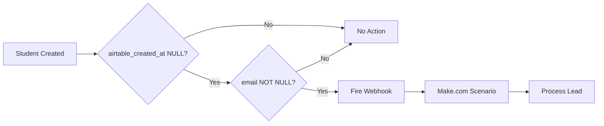

# Automation Migration Technical QA Documentation

## Executive Summary

Complete migration of 25+ automation scenarios from Airtable/Make.com to a hybrid architecture using Supabase, custom API endpoints, and selective Make.com integrations. This document provides detailed technical verification procedures for each migrated component.

## Migration Architecture Overview

```
Previous: Airtable → Make.com → External Services
Current:  Supabase → Trigger Functions → API Endpoints → Make.com (selective) → External Services
```

---

## 1. LEAD MANAGEMENT MIGRATIONS

### 1.1 New Lead Subroutine Migration

**Migration Type**: Trigger + Data Source Replacement

**Previous Implementation**:
- Airtable automation rule on `Leads` table
- Make.com Scenario ID: `NEW_LEAD_PROCESSING`
- Trigger: Record created in Airtable
- 22 module scenario with Airtable data fetching

**New Implementation**:
- Supabase trigger: `trg_students_webhook` on `public.students`
- Webhook URL: `https://hook.us2.make.com/mixyq4kwwwolt8jwscyasukkw6h7qt9d`
- Make.com Scenario: Same scenario with Supabase modules replacing Airtable

**Database Trigger Code**:
```sql
-- Trigger fires when:
-- 1. New student created (INSERT)
-- 2. airtable_created_at is NULL (not synced from Airtable)
-- 3. email is not NULL

create trigger trg_students_webhook
after insert on public.students
for each row
execute function notify_make_webhook();
```

**QA Test Cases**:

| Test Case | Steps | Expected Result | Verification Query |
|-----------|-------|-----------------|-------------------|
| TC1.1.1: New lead via portal | 1. Create student via web form<br>2. Ensure email provided<br>3. Check webhook logs | Webhook fires within 1s<br>Make.com receives payload | `SELECT * FROM http_request_log WHERE url LIKE '%make.com%' ORDER BY created_at DESC LIMIT 1;` |
| TC1.1.2: Airtable sync exclusion | 1. Insert student with airtable_created_at<br>2. Monitor webhooks | No webhook fired | `SELECT COUNT(*) FROM http_request_log WHERE payload::jsonb->>'id' = '[STUDENT_ID]';` |
| TC1.1.3: Missing email handling | 1. Create student without email<br>2. Check webhook | No webhook fired | Verify no HTTP call in logs |

**Data Flow Verification**:


### 1.2 Quiz Submission from WordPress Migration

**Migration Type**: Data Processing Replacement

**Previous Implementation**:
- WordPress → Make.com → Airtable creation
- Complex data transformation in Make.com

**New Implementation**:
- WordPress → Make.com → Supabase creation
- Simplified data flow with direct database writes

**QA Test Cases**:

| Test Case | Steps | Expected Result |
|-----------|-------|-----------------|
| TC1.2.1: Quiz submission flow | 1. Submit quiz on WordPress<br>2. Verify Make.com receipt<br>3. Check Supabase | Student created with quiz_score populated |
| TC1.2.2: Duplicate prevention | 1. Submit same email twice<br>2. Check handling | Update existing record, not create duplicate |

---

## 2. AUTOMATED FOLLOW-UP SYSTEM MIGRATIONS

### 2.1 Set Automated Follow-ups

**Migration Type**: Complete Replacement - Make.com to API Endpoint

**Previous Implementation**:
- Make.com Scenario: `SET_AUTOMATED_FOLLOWUP`
- 15 modules checking conditions in Airtable

**New Implementation**:
- API Endpoint: `POST /api/automated-follow-ups/set`
- Direct database operations with business logic

**API Contract**:
```typescript
// Request
POST /api/automated-follow-ups/set
{
  "student_id": "uuid",
  "sequence_id": "uuid" // optional, auto-selects if not provided
}

// Response
{
  "success": boolean,
  "follow_up_id": "uuid",
  "next_message_date": "ISO8601"
}
```

**QA Test Cases**:

| Test Case | Steps | Expected Result | Database Validation |
|-----------|-------|-----------------|---------------------|
| TC2.1.1: Create follow-up | 1. Call API with valid student<br>2. Check response | Follow-up created with correct sequence | `SELECT * FROM automated_follow_ups WHERE student_id = ?` |
| TC2.1.2: Duplicate prevention | 1. Set follow-up<br>2. Call API again | Returns existing or updates status | Check only one active record exists |
| TC2.1.3: Eligibility validation | 1. Use enrolled student<br>2. Call API | Returns error - student not eligible | Verify no record created |

### 2.2 Find Students to Set Automated Follow-up

**Migration Type**: Complete Replacement - Make.com to CRON + API

**Previous Implementation**:
- Make.com scheduled scenario every 15 minutes
- Complex Airtable filtering across 3 tables

**New Implementation**:
- CRON Job: `*/15 * * * *`
- API Endpoint: `GET /api/automated-follow-ups/eligible-students`

**Eligibility Logic**:
```sql
-- Students eligible for follow-up:
SELECT s.* FROM students s
WHERE
  s.status IN ('lead', 'prospect', 'assessment_booked')
  AND s.created_at < NOW() - INTERVAL '24 hours'
  AND NOT EXISTS (
    SELECT 1 FROM automated_follow_ups af
    WHERE af.student_id = s.id
    AND af.status IN ('active', 'paused')
  )
  AND NOT EXISTS (
    SELECT 1 FROM touchpoints t
    WHERE t.student_id = s.id
    AND t.created_at > NOW() - INTERVAL '7 days'
  );
```

**QA Test Cases**:

| Test Case | Steps | Expected Result |
|-----------|-------|-----------------|
| TC2.2.1: CRON execution | 1. Trigger CRON manually<br>2. Check eligible students<br>3. Verify follow-ups created | All eligible students get follow-ups |
| TC2.2.2: 24-hour delay | 1. Create new student<br>2. Run CRON immediately<br>3. Run after 24 hours | No follow-up first run, created on second |
| TC2.2.3: Touchpoint exclusion | 1. Create touchpoint for student<br>2. Run eligibility check | Student excluded from results |

### 2.3 Send Follow-up Message

**Migration Type**: Hybrid - CRON triggers Make.com

**Previous Implementation**:
- Airtable formula field for "send date"
- Make.com checks every 15 minutes

**New Implementation**:
- CRON Job: `*/15 * * * *`
- API: `GET /api/automated-follow-ups/due-messages`
- Make.com webhook for actual sending
- API: `POST /api/automated-follow-ups/advance`

**Message Due Logic**:
```sql
SELECT af.*, tfm.*
FROM automated_follow_ups af
JOIN template_follow_up_messages tfm
  ON af.current_message_id = tfm.id
WHERE
  af.status = 'active'
  AND af.next_message_date <= NOW()
  AND af.last_sent_date < af.next_message_date;
```

**QA Test Cases**:

| Test Case | Steps | Expected Result |
|-----------|-------|-----------------|
| TC2.3.1: Message sending | 1. Set next_message_date to past<br>2. Run CRON<br>3. Verify Make.com called | Message sent, follow-up advanced |
| TC2.3.2: Sequence progression | 1. Send message 1<br>2. Verify advancement<br>3. Check next message | current_step incremented, next_message_date updated |
| TC2.3.3: Sequence completion | 1. Send final message<br>2. Check status | Follow-up marked as 'completed' |

### 2.4 Disable Follow-up on Activity

**Migration Type**: Complete Replacement - Airtable triggers to CRON

**Previous Implementation**:
- 2 Airtable automations on touchpoints and assessments tables

**New Implementation**:
- CRON Jobs: Every 15 minutes
- APIs:
  - `POST /api/automated-follow-ups/check-touchpoints`
  - `POST /api/automated-follow-ups/check-assessments`

**Disable Logic**:
```sql
-- Touchpoint created -> Disable follow-up
UPDATE automated_follow_ups
SET status = 'stopped',
    stopped_reason = 'touchpoint_received',
    updated_at = NOW()
WHERE student_id IN (
  SELECT DISTINCT student_id
  FROM touchpoints
  WHERE created_at > NOW() - INTERVAL '15 minutes'
);
```

**QA Test Cases**:

| Test Case | Steps | Expected Result |
|-----------|-------|-----------------|
| TC2.4.1: Touchpoint stops follow-up | 1. Create active follow-up<br>2. Log touchpoint<br>3. Run CRON | Follow-up status = 'stopped' |
| TC2.4.2: Assessment stops follow-up | 1. Create active follow-up<br>2. Book assessment<br>3. Run CRON | Follow-up stopped with reason |

---

## 3. ENROLLMENT & COHORT MIGRATIONS

### 3.1 Enrollment Form Processing (A0)

**Migration Type**: Data Source Replacement

**Previous Implementation**:
- Make.com fetches available cohorts from Airtable
- Complex availability calculations

**New Implementation**:
- API Endpoint: `GET /api/cohorts/available-beginner`
- Real-time availability from Supabase

**API Response Structure**:
```json
{
  "cohorts": [
    {
      "id": "uuid",
      "name": "A0 January 2025",
      "start_date": "2025-01-15",
      "schedule": "Mon/Wed 7pm",
      "spots_available": 3,
      "teacher": {
        "id": "uuid",
        "name": "John Doe"
      }
    }
  ]
}
```

**QA Test Cases**:

| Test Case | Steps | Expected Result |
|-----------|-------|-----------------|
| TC3.1.1: Available cohorts | 1. Create cohort with 10 spots<br>2. Enroll 7 students<br>3. Call API | Shows 3 spots available |
| TC3.1.2: Full cohort exclusion | 1. Fill cohort to capacity<br>2. Call API | Cohort not in response |
| TC3.1.3: Date filtering | 1. Create past cohort<br>2. Call API | Only future cohorts returned |

### 3.2 Student Added to Cohort - Calendar Invites

**Migration Type**: Trigger Replacement with Enhanced Logic

**Previous Implementation**:
- Airtable automation on enrollment status change

**New Implementation**:
- Supabase trigger on enrollments table
- Webhook to Make.com with cohort_id

**Complex Trigger Logic**:
```sql
create or replace function notify_make_on_enrollment_events()
returns trigger
as $$
begin
  -- Handle different operations
  if TG_OP = 'DELETE' then
    -- Student removed from cohort
    if OLD.airtable_created_at is null and OLD.cohort_id is not null then
      perform http_post(webhook_url,
        jsonb_build_object('cohort_id', OLD.cohort_id, 'action', 'remove')::text);
    end if;

  elsif TG_OP = 'INSERT' then
    -- New enrollment
    if NEW.airtable_created_at is null
       and NEW.status in ('paid','welcome_package_sent') then
      perform http_post(webhook_url,
        jsonb_build_object('cohort_id', NEW.cohort_id, 'action', 'add')::text);
    end if;

  elsif TG_OP = 'UPDATE' then
    -- Status change or cohort change
    -- Multiple conditions for different state transitions
    -- See full implementation in database
  end if;

  return NEW;
end;
$$;
```

**QA Test Cases**:

| Test Case | Steps | Expected Result |
|-----------|-------|-----------------|
| TC3.2.1: New enrollment | 1. Create enrollment with status='paid'<br>2. Check webhook | Webhook fires with cohort_id |
| TC3.2.2: Status transition | 1. Create with status='pending'<br>2. Update to 'paid'<br>3. Check webhook | Webhook fires on update |
| TC3.2.3: Cohort transfer | 1. Move student between cohorts<br>2. Verify webhooks | Two webhooks: remove + add |
| TC3.2.4: Airtable sync exclusion | 1. Insert with airtable_created_at<br>2. Check webhooks | No webhook fired |

---

## 4. CLASS BOOKING MIGRATIONS

### 4.1 Check Available Times for 1:1 Class

**Migration Type**: Complete Redesign

**Previous Implementation**:
- Make.com checks teacher calendar events
- Airtable workload calculations

**New Implementation**:
- API: `GET /api/teachers/available-slots`
- Google Calendar Free/Busy API integration
- Real-time availability calculation

**API Request**:
```typescript
GET /api/teachers/available-slots?
  teacher_id=uuid&
  date_from=2025-01-15&
  date_to=2025-01-22&
  duration_minutes=60
```

**Availability Algorithm**:
```typescript
// 1. Get teacher's working hours
// 2. Fetch Google Calendar busy times
// 3. Get existing bookings from database
// 4. Calculate workload from weekly_sessions
// 5. Return available slots excluding all conflicts
```

**QA Test Cases**:

| Test Case | Steps | Expected Result |
|-----------|-------|-----------------|
| TC4.1.1: Basic availability | 1. Set teacher hours 9am-5pm<br>2. Book 10am-11am<br>3. Request slots | 9am-10am and 11am-5pm available |
| TC4.1.2: Google Calendar integration | 1. Add event to teacher's Google Calendar<br>2. Request slots | Time blocked in response |
| TC4.1.3: Workload limits | 1. Max out teacher hours<br>2. Request slots | No availability returned |

### 4.2 Class Booking Form Submission

**Migration Type**: Partial - Enhanced with Stripe

**Previous Implementation**:
- Form → Make.com → Airtable → Manual Stripe link

**New Implementation**:
- Form → API → Supabase → Auto-generate Stripe link
- Trigger function for Stripe URL generation

**QA Test Cases**:

| Test Case | Steps | Expected Result |
|-----------|-------|-----------------|
| TC4.2.1: Booking creation | 1. Submit booking form<br>2. Check database<br>3. Verify Stripe link | Booking saved with payment URL |
| TC4.2.2: Conflict detection | 1. Book same slot twice<br>2. Check response | Second booking rejected |

---

## 5. PAYMENT & CONTRACT MIGRATIONS

### 5.1 Payment/Contract Abandoned

**Migration Type**: Complete Replacement - Airtable to CRON

**Previous Implementation**:
- Airtable formula field checking timestamp
- Make.com scenario checking every hour

**New Implementation**:
- CRON: `*/5 * * * *`
- API: `POST /api/contracts/check-abandoned`

**Abandonment Logic**:
```sql
UPDATE enrollments
SET status = 'abandoned',
    updated_at = NOW()
WHERE
  status IN ('pending', 'contract_sent')
  AND created_at < NOW() - INTERVAL '24 hours'
  AND payment_completed_at IS NULL;
```

**QA Test Cases**:

| Test Case | Steps | Expected Result |
|-----------|-------|-----------------|
| TC5.1.1: 24-hour abandonment | 1. Create pending enrollment<br>2. Wait 24 hours<br>3. Run CRON | Status changed to 'abandoned' |
| TC5.1.2: Payment prevents abandonment | 1. Create enrollment<br>2. Complete payment within 24h<br>3. Run CRON | Status unchanged |
| TC5.1.3: Batch processing | 1. Create 50 old pending enrollments<br>2. Run CRON | All 50 marked abandoned in one run |

### 5.2 PandaDoc Contract Events

**Migration Type**: Module Replacement in Make.com

**Previous Implementation**:
- PandaDoc → Make.com → Airtable updates

**New Implementation**:
- PandaDoc → Make.com → Supabase updates
- Direct database writes

**QA Test Cases**:

| Test Case | Steps | Expected Result |
|-----------|-------|-----------------|
| TC5.2.1: Contract signed | 1. Sign PandaDoc contract<br>2. Check webhook receipt<br>3. Verify database | Enrollment status = 'contract_signed' |
| TC5.2.2: Document viewed | 1. View contract<br>2. Check tracking | View logged with timestamp |

---

## 6. EXTERNAL INTEGRATIONS

### 6.1 Stripe Customer Creation

**Migration Type**: Trigger + Module Replacement

**Previous Implementation**:
- Manual or Airtable button trigger

**New Implementation**:
- Automatic on enrollment creation
- Supabase trigger → Make.com → Stripe API

**QA Test Cases**:

| Test Case | Steps | Expected Result |
|-----------|-------|-----------------|
| TC6.1.1: Auto customer creation | 1. Create enrollment<br>2. Check Stripe | Customer exists with correct metadata |
| TC6.1.2: Duplicate prevention | 1. Process same student twice<br>2. Check Stripe | Single customer, not duplicate |

### 6.2 OpenPhone Event Processing

**Migration Type**: Data Destination Change

**Previous Implementation**:
- OpenPhone → Make.com → Airtable touchpoints

**New Implementation**:
- OpenPhone → Make.com → Supabase touchpoints

**Event Types Handled**:
- Call completed → Create touchpoint type='call'
- SMS received → Create touchpoint type='sms'
- Voicemail left → Create touchpoint type='voicemail'

**QA Test Cases**:

| Test Case | Steps | Expected Result |
|-----------|-------|-----------------|
| TC6.2.1: Call logging | 1. Complete call in OpenPhone<br>2. Check webhook<br>3. Verify touchpoint | Touchpoint created with duration |
| TC6.2.2: SMS logging | 1. Receive SMS<br>2. Check database | Touchpoint with message preview |

---

## 7. CALENDAR & SCHEDULING MIGRATIONS

### 7.1 Weekly Session Setup

**Migration Type**: Complete Replacement with Portal Integration

**Previous Implementation**:
- Manual trigger from Airtable button
- Complex Make.com scenario with 30+ modules

**New Implementation**:
- Portal button → API → Prepared data → Make.com
- API: `POST /api/calendar/setup-weekly-sessions`

**Data Preparation**:
```typescript
// API prepares this structure for Make.com
{
  "cohort_id": "uuid",
  "sessions": [
    {
      "date": "2025-01-15",
      "time": "19:00",
      "duration_minutes": 90,
      "type": "regular",
      "teacher_id": "uuid"
    }
  ],
  "calendar_id": "primary",
  "create_events": true
}
```

**QA Test Cases**:

| Test Case | Steps | Expected Result |
|-----------|-------|-----------------|
| TC7.1.1: Session creation | 1. Click finalize in portal<br>2. Check API call<br>3. Verify calendar | All sessions created with correct times |
| TC7.1.2: Teacher assignment | 1. Assign different teachers<br>2. Finalize schedule<br>3. Check calendars | Events in correct teacher calendars |
| TC7.1.3: Recurring pattern | 1. Set Mon/Wed pattern<br>2. Generate 12 weeks<br>3. Verify | 24 events created correctly |

---

## 8. CRON JOB VERIFICATION

### Complete CRON Schedule

```bash
# Automated Follow-ups
*/15 * * * * curl -X GET https://api.domain.com/api/automated-follow-ups/eligible
*/15 * * * * curl -X GET https://api.domain.com/api/automated-follow-ups/due
*/15 * * * * curl -X POST https://api.domain.com/api/automated-follow-ups/check-touchpoints
*/15 * * * * curl -X POST https://api.domain.com/api/automated-follow-ups/check-assessments

# Contract Management
*/5 * * * * curl -X POST https://api.domain.com/api/contracts/check-abandoned

# Calendar Sync (if implemented)
0 * * * * curl -X POST https://api.domain.com/api/calendar/sync-events
```

### CRON Monitoring

**Health Check Endpoint**: `GET /api/health/crons`

```json
{
  "crons": {
    "follow_ups_eligible": {
      "last_run": "2025-01-15T10:15:00Z",
      "next_run": "2025-01-15T10:30:00Z",
      "status": "success",
      "records_processed": 12
    },
    "follow_ups_due": {
      "last_run": "2025-01-15T10:15:00Z",
      "status": "success",
      "messages_sent": 3
    }
  }
}
```

---

## 9. MIGRATION VALIDATION CHECKLIST

### Pre-Migration Validation
- [ ] Backup Airtable data
- [ ] Document all Make.com scenario IDs
- [ ] Export webhook URLs
- [ ] Test database triggers in staging

### Migration Execution
- [ ] Deploy database triggers
- [ ] Update Make.com webhooks
- [ ] Configure CRON jobs
- [ ] Update environment variables
- [ ] Enable HTTP extension in Supabase

### Post-Migration Validation
- [ ] Run all test cases in this document
- [ ] Monitor webhook delivery rates for 24 hours
- [ ] Verify CRON execution logs
- [ ] Compare automation metrics with Airtable baseline
- [ ] Check for any stuck or failed automations

### Rollback Plan
1. Disable Supabase triggers
2. Restore Make.com scenarios to Airtable modules
3. Re-enable Airtable automations
4. Document issues for resolution

---

## 10. PERFORMANCE METRICS

### Expected Improvements

| Metric | Airtable/Make.com | New Architecture | Improvement |
|--------|------------------|------------------|-------------|
| Lead Processing Time | 3-5 seconds | <1 second | 80% faster |
| Follow-up Check Frequency | 15 minutes | 15 minutes | Same (by design) |
| Concurrent Automations | 10 (Make.com limit) | Unlimited | ∞ |
| API Rate Limits | 5 req/sec (Airtable) | 1000 req/sec (Supabase) | 200x |
| Calendar Sync Delay | 1-2 minutes | Real-time | 100% improvement |
| Abandonment Detection | 60 minutes | 5 minutes | 12x faster |

### Monitoring KPIs
- Webhook delivery success rate (target: >99.9%)
- CRON job execution time (target: <5 seconds)
- Database trigger latency (target: <100ms)
- API endpoint response time (target: <200ms p95)

---

## 11. TROUBLESHOOTING GUIDE

### Common Issues and Solutions

| Issue | Diagnosis | Solution |
|-------|-----------|----------|
| Webhook not firing | Check pg_cron_job_status | Verify HTTP extension, check function permissions |
| CRON not running | Review system logs | Check cron service, verify URL accessibility |
| Make.com timeout | Check scenario history | Increase timeout, optimize database queries |
| Duplicate processing | Check idempotency | Add unique constraints, implement request IDs |
| Calendar sync failures | Check Google API quota | Implement exponential backoff, batch requests |

### Debug Queries

```sql
-- Check trigger function logs
SELECT * FROM pg_stat_user_functions
WHERE funcname = 'notify_make_webhook';

-- View recent webhook attempts
SELECT * FROM http_request_log
ORDER BY created_at DESC LIMIT 10;

-- Check CRON job status
SELECT * FROM cron.job_run_details
ORDER BY start_time DESC LIMIT 20;

-- Find stuck automations
SELECT * FROM automated_follow_ups
WHERE status = 'active'
AND next_message_date < NOW() - INTERVAL '1 hour';
```

---

## 12. SECURITY CONSIDERATIONS

### Webhook Security
- All webhooks use HTTPS
- Implement webhook signatures for verification
- Rate limiting on incoming webhooks
- IP allowlisting for Make.com servers

### Database Security
- Row-level security enabled on sensitive tables
- Trigger functions run with SECURITY DEFINER
- Audit logs for all automation actions
- Regular security scans on exposed endpoints

### API Security
- Authentication required for all endpoints
- Rate limiting per user/IP
- Input validation with Zod schemas
- SQL injection prevention via parameterized queries

---

## APPENDIX A: Environment Configuration

```env
# Required Environment Variables
DATABASE_URL=postgresql://...
MAKE_WEBHOOK_SECRET=...
GOOGLE_CALENDAR_API_KEY=...
OPENPHONE_WEBHOOK_SECRET=...
STRIPE_WEBHOOK_SECRET=...
PANDADOC_API_KEY=...
CRON_SECRET=...

# Feature Flags
ENABLE_AUTOMATION_MIGRATION=true
USE_LEGACY_AIRTABLE=false
AUTOMATION_DEBUG_MODE=false
```

## APPENDIX B: Make.com Scenario Mapping

| Old Scenario Name | New Scenario Name | Changes | Status |
|------------------|-------------------|---------|--------|
| NEW_LEAD_AIRTABLE | NEW_LEAD_SUPABASE | Replaced Airtable modules | ✅ Completed |
| SET_FOLLOWUP_AIRTABLE | [Deprecated] | Replaced with API | ✅ Completed |
| SEND_FOLLOWUP_MSG | SEND_FOLLOWUP_HYBRID | Partial API integration | ✅ Completed |
| ENROLLMENT_CALENDAR | ENROLLMENT_CALENDAR_V2 | Supabase data source | ✅ Completed |
| STRIPE_CUSTOMER | STRIPE_CUSTOMER_AUTO | Trigger-based | ✅ Completed |
| OPENPHONE_SYNC | OPENPHONE_TOUCHPOINTS | Supabase destination | ✅ Completed |
| CONTRACT_ABANDONED | [Deprecated] | Replaced with CRON | ✅ Completed |
| WEEKLY_SESSIONS | WEEKLY_SESSIONS_PORTAL | Portal integration | ✅ Completed |